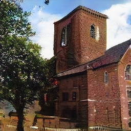
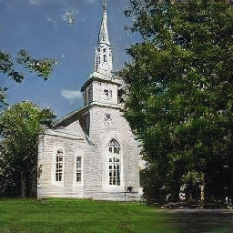
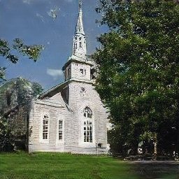

# homework3-GAN-Dissection

## Generate images with GANPaint
| Original |   draw   |   remove   |
| :------: | :------: | :--------: |
|  | (draw grass)| (remove tree)|
|  | (draw brick)| (remove grass)|
|  | (draw tree)| (remove brick)|

#### Failure Cases caused by unreasonable draw
- Curious about how the network would response to unreasonable draw, we draw brick/dome/door/grass at the upleft corner (sky).
- While drawing brick/dome/grass results in strong artifacts in all the painted area, drawing door for the same area only lead to small pieces of artifacts.

| Original | draw brick | draw dome | draw door | draw grass |
| :------: | :--------: | :-------: | :-------: | :--------: |
|  |  |  |  |  |
|  |  |  |  |  |

#### Affect the artifacts by drawing/removeing the same class
- The orignal image contains slight artifact in the sky, we found that drawing sky could help to remove the artifact, while removing sky would intensify the artifact.

| Original | draw sky | remove sky |
| :------: | :------: | :--------: |
|  |  |  |
|  |  |  |

## Dissect GAN model
#### Restaurant
- layer 5 Unit class distribution
    - 
- layer 8 Unit class distribution
    - 
- layer 5 examples

    | layer5   | remove window  | remove window | remove table | remove table | remove sky | remove sky |
    | :------: | :------------: | :-----------: | :----------: | :----------: | :--------: | :--------: |
    | before   |  |  |  |  |  |  |
    | after    |   |  |  |  |  |  |

#### Church Outdoor 
- layer 5 Unit class distribution
    - 
- layer 8 Unit class distribution
    - 
- layer 8 examples

    | layer8   | remove foliage  | remove foliage | remove stone | remove stone |
    | :------: | :------------: | :-----------: | :----------: | :----------: |
    | before   |  |  |  |  |
    | after    |   |  |  |  |

## Compare with [inpainting](https://github.com/akmtn/pytorch-siggraph2017-inpainting)
Below we compare the scene ablation result of GANPaint and [Globally and Locally Consistent Image Completion](http://iizuka.cs.tsukuba.ac.jp/projects/completion/en/) using same source image and similar mask.

| id  | source | mask | inpainting | ganpaint |
| :-: | :------: | :------: | :--------: | :-----: |
| (a) |  |  |  (unreasonable scene) |  (slightly better) |
| (b) |  |  |  (blurry result) |  (doesn't remove window) |
| (c) |  |  |  (blurry result) |  (acceptable) |
| (d) |  |  |  (unreasonable scene) |  (from grass to rock) |
| (e) |  |  |  (try to add wooden roof?) |  (acceptable) |
| (f) |  |  |  (blurry result) |  (doesn't remove anything) |
| (g) |  |  |  (acceptable) |  (doesn't remove anything) |
| (h) |  |  |  (doesn't remove anything) |  (inference the structure behind tree!!) |

From the above results, we observe that the inpainting method often failed in case of removing large part of scene (e.g. tree, grass) resulting in a totaly unreasonable scene. On the other hands, ganpaint can yield better result in such scenario. In sample (d), ganpaint succefully convert the grass to rock and the overall scene look reasonable. In sample (h), to our surprise, ganpaint even infer the building structure behind the tree.

In case of smaller object (e.g. door, window), the inpainting method can often remove the object but with blurry result ((b), (c), (f), (g)). Ganpaint, in this case, often remain the original things which could be dut to the high probability that a door or window on that position.
